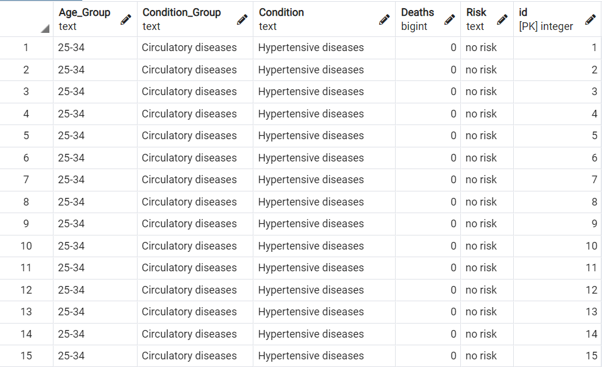
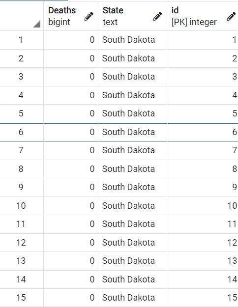
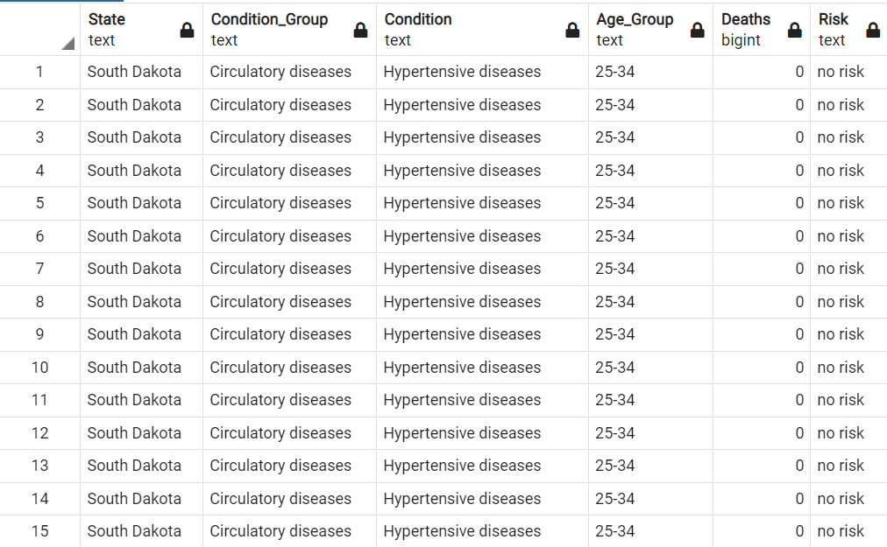
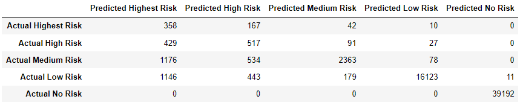

[google slides presentation](https://docs.google.com/presentation/d/1resQNn_J3zpFqKbY74MHXcx0pu5iFgAxBG7AjOV-3mg/edit?usp=sharing)

[tableau dashboard](https://public.tableau.com/app/profile/rose8042/viz/Capstone_Project_16671930307510/COVID-19Deathsgeneral?publish=yes)

# COVID-19 Risk Assessment Presentation
The topic of our project is COVID-19. While observing COVID-19 mortality rates we will be taking a deeper dive as to the causes of these deaths (age, co-morbidities,etc.) and the conditions that may have contributed to those deaths. We will also be looking at how the deaths are distributed across different age groups.

There are several reasons we selected this topic. Wide base of knowledge in COVID-19 data, broad perspectives, dynamic, varying yet reliable, plethora of data soruces.

Our data comes from the Center for Disease Control, at data.cdc.gov, where many different datasets covering a variety of topics is available. Our dataset contains 14 columns and 472,000 rows. 

Some questions we are looking to answer with this dataset is: 
#### How did various health conditions contribute to COVID-19 Deaths?
#### How did age contribute to COVID-19 Deaths?
#### How did location contribute to COVID-19 Deaths?
#### Did age or underlying health conditions have a bigger impact on COVID-19 outcomes?
#### Compare and contrast conditions with higher incidence of death vs. conditions with lower incidence of death?
#### What is death rate per 100,000?
#### How does this data tie into predictive analytics and why is this critical in fighting COVID-19? 
Irrespective of the variations in available data, stakeholders (policy makers) have to make critical decisions resulting in meaningful implications for both COVID-19 transmission and mortality. These analytics can be a game changer in predictive models evaluating a plethora of “what if” scenarios to guide decision-making.

### Database

Table used for machine learning model: covid_data table

Second table for join function: death_by_state table

Joined table: covid_state table

### Dashboard Blueprint
To create our final dashboard we will be utilizing the public version of the software Tableau. This is a data visualization tool that makes it easy to explore and manage data. It also lends itself well to playing around with visualizations to see what will work best with your project.

For the interactive element of our project, we are planning to use a filtered map, where the viewer can toggle the different health condition groups or health conditions present in our data to see for themselves if one condition or another contributed more to COVID-19 deaths in a particular state.

### Machine Learning Model
#### What was the preliminary data preprocessing? Feature engineering and preliminary feature selection? (including their decision-making process)
In terms of exploratory data analysis, many columns of the original dataset did not appear to be useful for the random forest model. Specifically, columns relating to time, including Date As of, Start Date, end Date, Year, and Month, were dropped. Additionally, columns which were unclear or inconsistent including Group, ICD10_codes, Flag and Number of Mentions were dropped. Further exploratory data analysis included the creation of features which did not exist previously. Age was anticipated to be an important factor, so a new table was created which includes the number of instances of each age group per state.

#### How was the data split into training and testing sets?
For preprocessing for the machine learning model, the target variable was dropped from the table. 

The train_test_split function was used to randomly split the data into training and testing sets. In our case, a sample dataframe was created using 50% of the original dataset. Of this 50%, 75% of the data was used for training and 25% was used for testing.

When the random forest model was rerun using the full dataset, the data was similarly split, with 75% of the data used for training and 25% used for testing. The train_test_split function was used, which allows for data to be randomly split into training and testing sets. Using the same split between training and test sets ensures that consistency of the results. 

#### What is model choice? What are limitations and benefits?
The BalancedRandomForestClassifier method from the Scikit-learn library was chosen for the learning model. The Random Forest model was chosen because it offers a good balance between accuracy and interpretability. Compared to other machine learning models with a similar degree of accuracy, like Deep Learning, the Random Forest model offers improved interpretability. Having many trees can also prevent against overfitting. One disadvantage of the random forest model is that it operates better with discrete data, so continuous features may have to be broken up so that the model can function, as was done by binning the target variable during feature selection.  

Using number of deaths, 5 bins were created to indicate risk categories. The categories included the following:
- 0 deaths = No risk
- 1-100 deaths = Low risk
- 101-500 deaths = Medium risk
- 501-1,500 deaths = High risk
- 1501-280,000 = Highesk risk 

#### Current Accuracy Score
71.5% balanced accuracy score using complete dataset. High precision corresponds to a low rate of false positives, while high recall corresponds to a low rate of false negatives. Striking a balance between precision and recall is trade-off which can prioritize and highlight different aspects of a model's effectiveness. The precision score for the whole dataset was .12 for the highest risk group, .88 for the medium risk group, and .99 for the low risk group. The recall for the whole dataset was .62 for the highest risk group, .57 for the medium risk group, and .90 for the low risk group. 
#### Confusion Matrix

- 358 of 577 or 62.04% of "Highest Risk" cases were predicted correctly
- 517 of 1,064 or 48.59% of "High Risk" cases were predicted correctly
- 2363 of 4,151 or 56.93% of "Medium Risk" cases were predicted correctly
- 16123 of 17,902 or 90.06% of "Low Risk" cases were predicted correctly
- 100% of "No Risk" cases were predicted correctly
